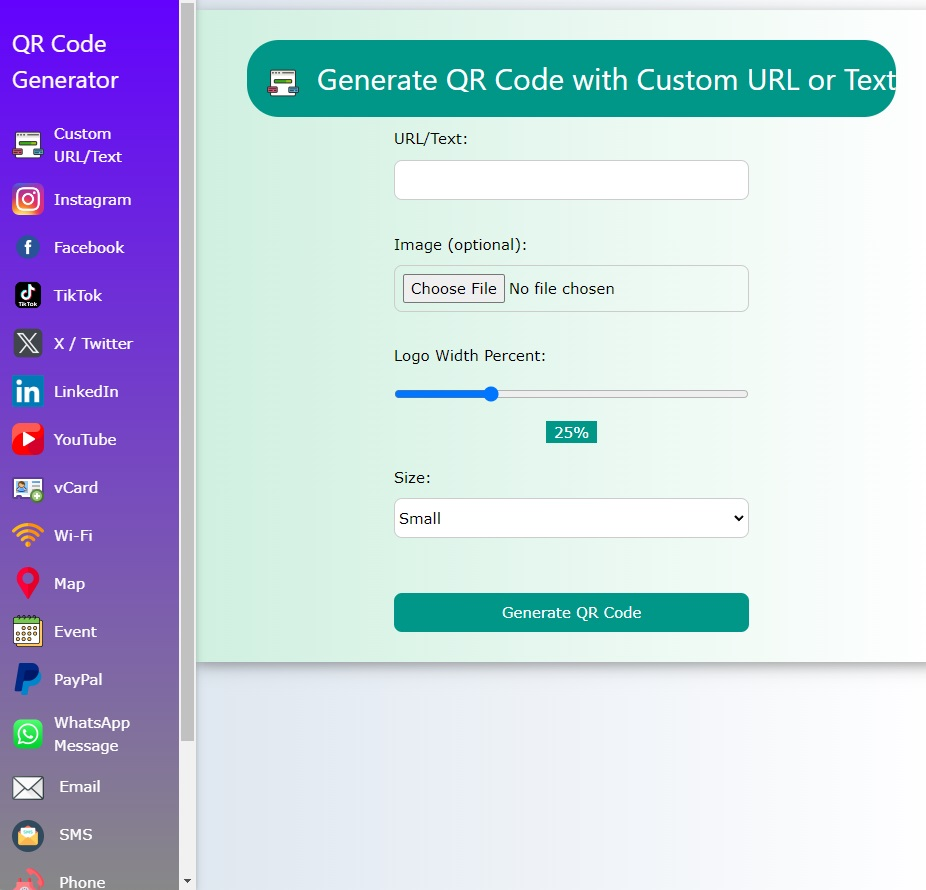
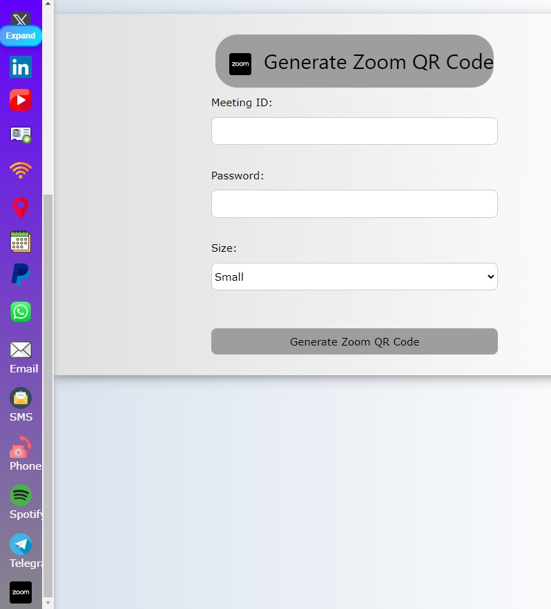

# GoQrCodeGen - QR Code Generator

Welcome to GoQrCodeGen, a powerful and user-friendly QR code generator built with Go. This tool allows you to create QR codes for a variety of purposes, including URLs, Zoom meetings, Telegram chats, vCards, and more. With customizable options and high-quality output, GoQrCodeGen makes it easy to generate and share QR codes.

## Features

- **Versatile QR Code Generation**: Generate QR codes for URLs, Zoom meeting IDs, Telegram usernames, vCards, and more.
- **Customizable QR Code Size**: Choose the size of your QR code to fit your needs.
- **Branding with Logos**: Overlay custom logos on your QR codes for branding purposes.
- **High-Quality Output**: Generate high-quality PNG images for easy sharing and scanning.
- **User-Friendly Interface**: A simple and intuitive web interface for generating QR codes.

| Screenshot |
| --- |
|  | 
|  | 

## Getting Started

### Installation

1. Clone the repository:
   ```bash
   git clone https://github.com/jackyes/GoQrCodeGen.git
   ```

2. Navigate to the project directory:
   ```bash
   cd GoQrCodeGen
   ```

3. Install the required dependencies:
   ```bash
   go mod download
   ```

4. Run the application:
   ```bash
   go run main.go
   ```

### Usage

1. **Access the Web Interface**: Open your web browser and navigate to `http://localhost:5555`.
2. **Select QR Code Type**: Choose the type of QR code you want to generate from the available options (URL, Zoom meeting, Telegram, vCard, etc.).
3. **Enter Required Information**: Provide the necessary details such as the URL, Zoom meeting ID, or Telegram username/group name.
4. **Set QR Code Size**: Select the desired size for your QR code.
5. **Generate QR Code**: Click the "Generate QR Code" button. The program will generate the QR code and display it on the screen.
6. **Save QR Code**: Right-click on the QR code image and select "Save Image As" to save it as a PNG file.

## Contact

If you have any questions or suggestions, feel free to open an issue or contact us directly.

Happy QR coding!
