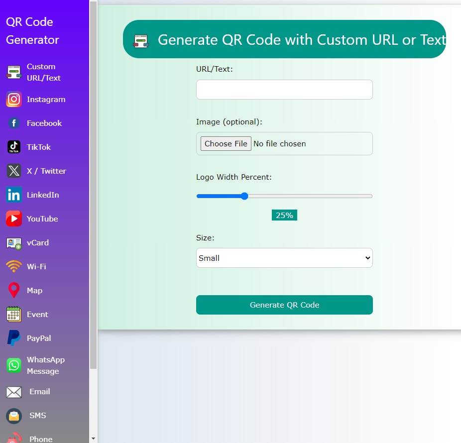
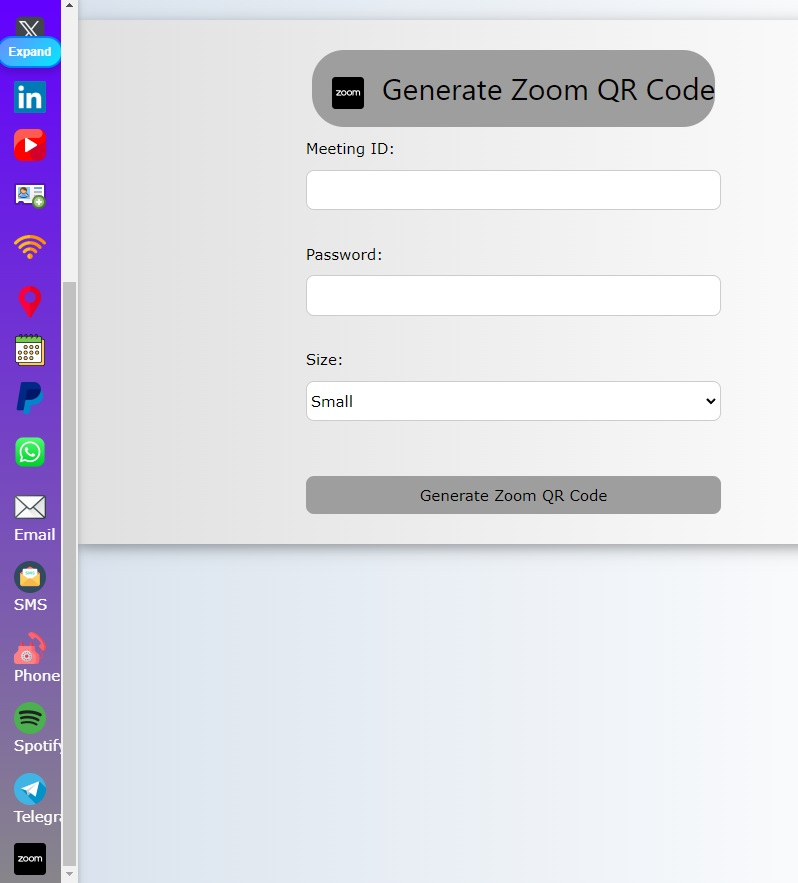

# GoQrCodeGen

QR Code generator written in Go. Creates QR codes for URLs, social media, WiFi, vCard, payments, and more — with logo overlay and customizable options.

## Features

- **18 QR code types** — URL, social profiles, WiFi, vCard, events, payments, email, SMS, phone, and more
- **Logo overlay** — automatic service logos or upload your own
- **4 sizes** — 128, 256, 512, 1024 pixels
- **Opacity control** — adjustable logo transparency
- **Custom logo upload** — overlay any image on generic QR codes and vCards
- **PNG output** — all QR codes generated as high-quality PNG

## Supported QR Code Types

| Type | Endpoint | Description |
|------|----------|-------------|
| URL | `/generate` | Generic URL with optional custom logo |
| Instagram | `/generate_instagram` | Instagram profile link |
| Facebook | `/generate_facebook` | Facebook profile link |
| TikTok | `/generate_tiktok` | TikTok profile link |
| LinkedIn | `/generate_linkedin` | LinkedIn profile link |
| YouTube | `/generate_youtube` | YouTube channel link |
| X (Twitter) | `/generate_x` | X profile link |
| Telegram | `/generate_telegram` | Telegram user or group link |
| Spotify | `/generate_spotify` | Spotify link |
| vCard | `/generate_vcard` | Contact card (name, phone, email, etc.) |
| WiFi | `/generate_wifi` | WiFi network credentials |
| Map | `/generate_map` | Geographic coordinates |
| Event | `/generate_event` | Calendar event |
| PayPal | `/generate_paypal` | PayPal payment link |
| WhatsApp | `/generate_whatsapp` | WhatsApp chat link |
| Email | `/generate_email` | Email composition link |
| SMS | `/generate_sms` | SMS composition link |
| Phone | `/generate_phone` | Phone call link |
| Zoom | `/generate_zoom` | Zoom meeting link |

## Getting Started

### Prerequisites

- Go 1.20+

### Installation

```bash
git clone https://github.com/jackyes/GoQrCodeGen.git
cd GoQrCodeGen
go mod download
go run .
```

Open `http://localhost:5555` in your browser.

## Screenshots

| Custom QR | Zoom QR |
|-----------|---------|
|  |  |

## Project Structure

```
GoQrCodeGen/
├── main.go          # Server setup and routing
├── handlers.go      # HTTP handlers for all QR code types
├── qrgen.go         # QR generation and image manipulation
├── vcard.go         # vCard string builder
├── static/          # Frontend assets (HTML, CSS, logos)
└── Screenshot/      # Preview screenshots
```
